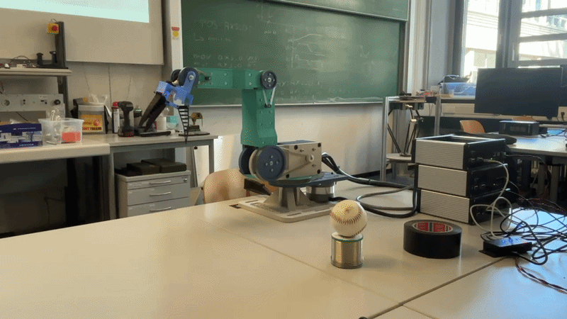

# Robot CAN RPI Module

This repository sets up a ROS2-based control system for a robot using CANopen communication on a Raspberry Pi. The system is split between a Docker container (running ROS2 and robot control logic) and the host machine (handling CAN communication). Joint states are transmitted over the CANopen bus and can be visualized from a separate device on the same network.

---

## System Architecture

```
┌─────────────────┐    WiFi/Ethernet    ┌─────────────────┐
│ Visualization   │◄──────────────────► │ Raspberry Pi    │
│ Device          │    DDS Messages     │                 │
│ (MoveIt/RViz)   │                     │ ┌─────────────┐ │
└─────────────────┘                     │ │   Docker    │ │
                                        │ │   ROS2      │ │
                                        │ │   Control   │ │
                                        │ └─────────────┘ │
                                        │        │        │
                                        │ ┌─────────────┐ │
                                        │ │CAN Interface│ │
                                        │ │   (Host)    │ │
                                        │ └─────────────┘ │
                                        └─────────┬───────┘
                                                  │ CAN Bus
                          ┌───────────────────────┼───────────────────────┐
                          │                       │                       │
                 ┌────────▼────────┐    ┌────────▼────────┐    ┌────────▼────────┐
                 │ Motion Control 1│◄──►│ Motion Control 2│◄──►│ Motion Control 3│
                 │   (Joints 1,2)  │    │   (Joints 3,4)  │    │    (Gripper)    │
                 └─────────────────┘    └─────────────────┘    └─────────────────┘
```

The system consists of three motion controllers daisy-chained on the CANopen bus:
- **Motion Controller 1**: Controls joints 1 and 2
- **Motion Controller 2**: Controls joints 3 and 4  
- **Motion Controller 3**: Controls the gripper mechanism

---

## Related Repositories

This project is part of a multi-repository system:

- **🤖 Robot Control (This Repository)**: Raspberry Pi ROS2 control system with CANopen communication
- **🖥️ Visualization Interface**: ([ROS Workspace for the Robot Visualization](https://github.com/mama1120/robot_arm_control_UI_HKA))- MoveIt/RViz interface for robot planning, control and visualization
- **⚙️ Motion Controller Firmware**: ([Firmware Project for the Motion Controllers](https://github.com/mama1120/robot_arm_motion_controller_STM32)) - Embedded firmware for the CANopen motion controllers

---

## Prerequisites

### Hardware Used
- Raspberry Pi 5
- CAN HAT or USB-CAN adapter
- Robot with 3 CANopen motion controllers (daisy-chained configuration)
- WiFi connection for both devices

### Network Setup
1. Both devices (Raspberry Pi and visualization computer) must be on the same network
2. Note the IP addresses of both devices:
   ```bash
   # On Raspberry Pi
   hostname -I
   
   # On visualization device
   ip addr show | grep inet
   ```
3. Ensure ports 7400-7500 (DDS default range) are open between devices

---

## Setup Instructions

### 1. Clone the Repository

```bash
git clone https://github.com/mama1120/rpi_ros_can_module.git
cd rpi_ros_can_module
```

### 2. Build the Docker Container

Run the build script:

```bash
./build_docker.sh
```

If the script cannot be executed, make it executable first:

```bash
chmod +x build_docker.sh
```
The container only needs to be built once!

---

### 3. Configure DDS for Multi-Device Communication

Update the peer IP addresses in the DDS configuration file to match your network setup:

**File:** `cyclonedx_config/CycloneDDS.xml`

```xml
<CycloneDDS>
  <Domain id="0">
    <General>
      <DontRoute>true</DontRoute>
      <AllowMulticast>false</AllowMulticast>
      <EnableMulticastLoopback>true</EnableMulticastLoopback>
    </General>
    <Discovery>
      <ParticipantIndex>auto</ParticipantIndex>
      <MaxAutoParticipantIndex>50</MaxAutoParticipantIndex>
      <Peers>
        <Peer Address="192.168.4.159"/>  <!-- Visualization device IP -->
        <Peer Address="192.168.4.152"/>  <!-- Raspberry Pi IP -->
      </Peers>
    </Discovery>
  </Domain>
</CycloneDDS>
```

**Replace the IP addresses with your actual device IPs.**

---

### 4. Start CAN Communication

Open a new terminal and navigate to the `can_setup` directory:

```bash
cd can_setup
./can.sh
```

This will provide real-time feedback on the CAN communication status, such as:
- Joint states being published
- Data acquisition
- Bus availability or congestion

If the CAN communication is not stopped correclty, for example if a device loses power, the line might still appear busy. If that is the case, use the following command:

```bash
sudo ip link set can0 down
```
---

### 5. Start the Docker Container

In a new terminal, launch the container:

```bash
./start_docker.sh
```

Your prompt should change to:
```
robot@<container-id>:~/ros2_ws$
```

---

### 6. Build and Source the ROS2 Workspace

Inside the container:

```bash
colcon build --symlink-install
source install/setup.bash
```

If build fails, try cleaning first:
```bash
rm -rf build install log
colcon build --symlink-install
```

---

### 7. Launch the Robot Control System

Start the ROS2 nodes and MoveIt configuration:

```bash
ros2 launch robot_moveit_config planning_execution.launch.py
```

This will:
- Publish joint states over the CAN bus
- Launch planning and execution nodes
- Connect via DDS to a remote visualization interface

To move and plan robot motion, use the remote visualization interface on the second device.

When everything works, the UI will be able to control the robot as seen in the following gif:



---

## Troubleshooting

### CAN Interface Issues

**Problem**: `can.sh` fails or no CAN traffic
```bash
# Check CAN hardware
lsmod | grep can
dmesg | grep -i can

# Reset CAN interface
sudo ip link set can0 down
sudo ip link set can0 up type can bitrate 1000000
```

**Problem**: Permission denied on CAN interface
```bash
# Add user to can group
sudo usermod -a -G dialout $USER
# Logout and login again
```

### Docker Issues

**Problem**: Container won't start
```bash
# Check Docker service
sudo systemctl status docker
sudo systemctl start docker

# Check container logs
docker logs <container-name>
```

**Problem**: Permission denied in container
```bash
# Rebuild with current user
./build_docker.sh --rebuild
```

### DDS Communication Issues

**Problem**: Devices can't discover each other
1. Verify both devices are on same network
2. Check firewall settings:
   ```bash
   # On Ubuntu/Debian
   sudo ufw status
   sudo ufw allow 7400:7500/udp
   ```
3. Test with simple publisher/subscriber:
   ```bash
   # Device 1
   ros2 run demo_nodes_cpp talker
   
   # Device 2
   ros2 run demo_nodes_cpp listener
   ```

**Problem**: High latency or dropped messages
- Check network quality: `ping -c 10 <other-device>`
- Monitor network usage: `iftop` or `nload`
- Consider switching to ethernet connection

### Runtime Issues

**Problem**: Joint states not updating
1. Check CAN communication
2. Verify joint state publisher is running:
   ```bash
   ros2 node info /joint_state_publisher
   ```
3. Check for error messages in logs
4. Verify all three motion controllers are responding:
   ```bash
   # Check for all motion controller nodes on CAN bus
   candump can0 | grep "motion_controller"
   ```

**CAN Communication Line Busy**
If after starting the CAN communication you see the following, shut down the CAN communication and start it again:


```bash
RTNETLINK answers: Device or resource busy
```
To shutdown CAN:
```bash
sudo ip link set can0 down
```
---
**Permission Denied When Running Bash Scripts**
If the file cannot be executed, try changing the permissions and make the file executable (e.g. can.sh, start_docker.sh, build_docker.sh) 
```bash
chmod +x <file_name.sh>
```
## Repository Structure

```
rpi_ros_can_module/
├── can_setup/                   # CAN interface scripts and config
│   ├── can.sh                   # Main CAN setup script
│   └── config/                  # CAN configuration files
├── config/                      # General system configuration
├── cyclonedx_config/           # DDS configuration
│   └── CycloneDDS.xml          # DDS network settings
├── robot_ws/                    # Main ROS2 workspace
│   ├── src/                     # Source packages
│   │   ├── robot_support/       # Robot hardware interface
│   │   ├── robot_description/   # Robot URDF/meshes
│   │   └── robot_moveit_config/ # MoveIt configuration
│   └── install/                 # Built packages
├── ws_moveit2/                  # MoveIt2 source workspace (optional)
├── build_docker.sh              # Docker build script
├── Dockerfile                   # Container definition
├── start_docker.sh              # Container launch script
└── README.md                    # This documentation
```

---

## Additional Resources

- [ROS2 Documentation](https://docs.ros.org/en/humble/)
- [MoveIt2 Documentation](https://moveit.ros.org/)
- [CANopen Documentation](https://www.can-cia.org/canopen/)
- [CycloneDDS Configuration Guide](https://github.com/eclipse-cyclonedx/cyclonedx/blob/master/docs/manual/config.rst)

---

## System Integration Notes

### Motion Controller Configuration
Each motion controller in the daisy chain has a unique CANopen node ID:
- Motion Controller 1 (Joints 1,2): Node ID 0x02
- Motion Controller 2 (Joints 3,4): Node ID 0x03  
- Motion Controller 3 (Gripper): Node ID 0x04
